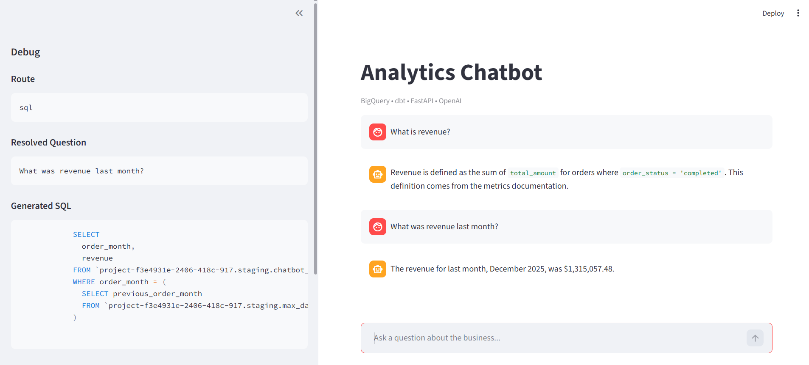

# E-commerce Analytics Chatbot with BigQuery, dbt, and Airflow

## Demo



This project implements a small analytics platform designed to simulate a modern data stack. The system generates a realistic synthetic e-commerce dataset, loads it into BigQuery, and transforms the raw data into curated analytical models using dbt. Pipeline execution and data refresh are orchestrated with Apache Airflow.

On top of these analytical models, a chatbot interface allows users to query key business metrics such as revenue, customer activity, and product performance using natural language.

## Architecture

               Python
       Synthetic Data Generator
                 │
                 ▼
              BigQuery
           Raw Data Layer
                 │
                 ▼
                dbt
         Data Transformations
                 │
                 ▼
         Analytics Data Marts
                 │
                 ▼
              Chatbot

## Chatbot Architecture

The chatbot layer is implemented using FastAPI and integrates multiple components:

- **Routing layer**: classifies questions into SQL, RAG, or Hybrid
- **SQL executor**: generates and runs safe queries against BigQuery
- **RAG system**: retrieves relevant documentation snippets
- **LLM layer**: generates natural language responses
- **Memory layer**: tracks conversation context and follow-up questions

### Flow

User → Streamlit UI → FastAPI (Cloud Run) → Router  
→ SQL (BigQuery) OR RAG → LLM → Response

## Deployment

The API is containerized with Docker and deployed to Google Cloud Run.

- FastAPI backend deployed on Cloud Run
- BigQuery accessed via service account (IAM, no credentials file)
- Secrets (OpenAI API key) managed with Secret Manager
- Scales to zero when idle


### Pipeline Orchestration

The data pipeline is orchestrated using Apache Airflow. The DAG coordinates the full ELT workflow:

Generate synthetic e-commerce data

Validate dataset integrity and business rules

Load raw tables into BigQuery

Execute dbt transformations

Run dbt tests


### Synthetic Data Validation

The dataset is validated with automated checks covering referential integrity, event ordering, and realistic behavioral patterns such as long-tail purchasing distributions and seasonal demand.

## Data Transformation


Data transformations are implemented using **dbt**.  
Raw BigQuery tables are cleaned and standardized in a staging layer before being used by analytical models.

Example staging models include:

- `stg_customers`
- `stg_orders`

These models handle tasks such as type normalization and null handling.

## dbt Lineage

The transformation layer is implemented in dbt and organized into staging, intermediate, and mart models. The lineage graph documents dependencies between raw tables, transformations, and final analytical models.

## Features

- Natural language analytics over BigQuery
- Automatic routing (SQL / RAG / Hybrid)
- Safe SQL generation (restricted queries only)
- Follow-up question handling using memory
- Debug panel showing route, SQL, and sources
- In-memory caching to reduce repeated queries
- Fully containerized and cloud-deployed API

## Project Structure

       analytics-chatbot-bigquery
       │
       ├── airflow
       │   ├── dags
       │   │   └── ecommerce_elt_pipeline.py
       │   ├── docker-compose.yml
       │   ├── Dockerfile
       │   └── requirements-airflow.txt
       │
       ├── chatbot/
       │    │   ├── api/
       │    │   │   └── main.py
       │    │   ├── core/
       │    │   ├── llm/
       │    │   ├── rag/
       │    │   ├── services/
       │    │   ├── sql/
       │    │   └── ui/
       │    │       └── streamlit_app.py
       │
       ├── dbt_project
       │   ├── models
       │   │   ├── staging
       │   │   ├── intermediate
       │   │   └── marts
       │   └── dbt_project.yml
       │
       ├── scripts
       │   ├── generate_synthetic_ecommerce.py
       │   ├── validate_synthetic_ecommerce.py
       │   └── load_to_bigquery.py
       │
       ├── data
       │   └── generated synthetic datasets
       │
       ├── Makefile
       └── README.md


### Data Pipeline (Airflow)

#### Start the local environment:

make start

#### Open the Airflow UI:

http://localhost:8080

#### Trigger the pipeline:

ecommerce_elt_pipeline

#### Stop the environment:

make stop

### Chatbot UI (Streamlit)

Run the UI locally and connect to the deployed API:

```bash
CHATBOT_API_URL=https://chatbot-api-116752934914.us-central1.run.app/chat
streamlit run chatbot/ui/streamlit_app.py
```
### API (FastAPI - Local Development)

Run the API locally:

```bash
uvicorn chatbot.api.main:app --reload
```
Then access:

API docs: http://127.0.0.1:8000/docs
Health check: http://127.0.0.1:8000/health

### Deployment

The API is deployed on Google Cloud Run.

To deploy:

```bash
gcloud builds submit
gcloud run deploy chatbot-api
```

## Tech Stack

- Python — data generation, backend logic, integrations

- BigQuery — cloud data warehouse

- dbt — transformations and analytical modeling

- Apache Airflow — pipeline orchestration

- FastAPI — chatbot API

- Streamlit — frontend UI

- ocker — containerization

- Google Cloud Run — API deployment

- Secret Manager — secret storage

- OpenAI API — natural language generation

## Limitations

- Only approved analytical query patterns are supported

- Caching is currently in-memory only

- RAG coverage depends on the size of the documentation knowledge base

- Chatbot behavior is optimized for demo and portfolio use, not high-throughput production workloads
