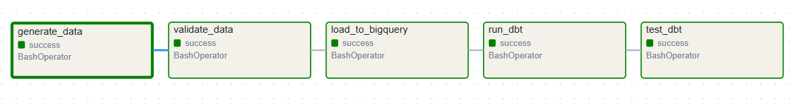

# E-commerce Analytics Chatbot with BigQuery, dbt, and Airflow

This project implements a small analytics platform designed to simulate a modern data stack. The system generates a realistic synthetic e-commerce dataset, loads it into BigQuery, and transforms the raw data into curated analytical models using dbt. Pipeline execution and data refresh are orchestrated with Apache Airflow.

On top of these analytical models, a chatbot interface allows users to query key business metrics such as revenue, customer activity, and product performance using natural language.

## Architecture

       Python
       Synthetic Data Generator
          │
          ▼
       BigQuery
       Raw Data Layer
          │
          ▼
       dbt
       Data Transformations
          │
          ▼
       Analytics Data Marts
          │
          ▼
       Chatbot

### Pipeline Orchestration

The data pipeline is orchestrated using Apache Airflow. The DAG coordinates the full ELT workflow:

Generate synthetic e-commerce data

Validate dataset integrity and business rules

Load raw tables into BigQuery

Execute dbt transformations

Run dbt tests

### Synthetic Data Validation

The dataset is validated with automated checks covering referential integrity, event ordering, and realistic behavioral patterns such as long-tail purchasing distributions and seasonal demand.

## Data Transformation

Data transformations are implemented using **dbt**.  
Raw BigQuery tables are cleaned and standardized in a staging layer before being used by analytical models.

Example staging models include:

- `stg_customers`
- `stg_orders`

These models handle tasks such as type normalization and null handling.

## dbt Lineage

The transformation layer is implemented in dbt and organized into staging, intermediate, and mart models. The lineage graph documents dependencies between raw tables, transformations, and final analytical models.

## Project Structure

       analytics-chatbot-bigquery
       │
       ├── airflow
       │   ├── dags
       │   │   └── ecommerce_elt_pipeline.py
       │   ├── docker-compose.yml
       │   ├── Dockerfile
       │   └── requirements-airflow.txt
       │
       ├── dbt_project
       │   ├── models
       │   │   ├── staging
       │   │   ├── intermediate
       │   │   └── marts
       │   └── dbt_project.yml
       │
       ├── scripts
       │   ├── generate_synthetic_ecommerce.py
       │   ├── validate_synthetic_ecommerce.py
       │   └── load_to_bigquery.py
       │
       ├── data
       │   └── generated synthetic datasets
       │
       ├── Makefile
       └── README.md

## Running the Project

### Start the local environment:

make start

### Open the Airflow UI:

http://localhost:8080

### Trigger the pipeline:

ecommerce_elt_pipeline

### Stop the environment:

make stop

## Tech Stack

Python — synthetic data generation and ETL

BigQuery — cloud data warehouse

dbt — data transformation and modeling

Apache Airflow — pipeline orchestration

Docker — reproducible development environment