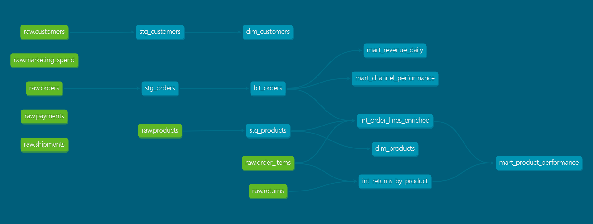

# E-commerce Analytics Chatbot with BigQuery, dbt, and Airflow

## Demo


This project implements a small analytics platform designed to simulate a modern data stack. The system generates a realistic synthetic e-commerce dataset, loads it into BigQuery, and transforms the raw data into curated analytical models using dbt. Pipeline execution and data refresh are orchestrated with Apache Airflow.

On top of these analytical models, a chatbot interface allows users to query key business metrics such as revenue, customer activity, and product performance using natural language.

## Architecture

               Python
       Synthetic Data Generator
                 │
                 ▼
              BigQuery
           Raw Data Layer
                 │
                 ▼
                dbt
         Data Transformations
                 │
                 ▼
         Analytics Data Marts
                 │
                 ▼
              Chatbot

---

## Chatbot Architecture

```text
User
 │
 ▼
Streamlit UI
 │
 ▼
FastAPI API
 │
 ▼
Router / Agent Layer
 ├── SQL route    → SQL generation → BigQuery → LLM response
 ├── RAG route    → Documentation retrieval → LLM response
 └── Hybrid route → BigQuery + RAG context → LLM response
```

### Core components

| Component | Responsibility |
|---|---|
| Router | Classifies each question as SQL, RAG or Hybrid. |
| SQL layer | Builds safe analytical queries and executes them in BigQuery. |
| RAG layer | Retrieves relevant snippets from project documentation. |
| LLM layer | Produces final natural-language answers. |
| Memory layer | Keeps short conversational context for follow-up questions. |
| Cache layer | Reduces repeated calls for identical or similar requests. |
| Debug layer | Exposes route, SQL, sources and execution metadata in the UI. |

---

### Flow

User → Streamlit UI → FastAPI (Cloud Run) → Router  
→ SQL (BigQuery) OR RAG → LLM → Response

## Deployment

The API is containerized with Docker and deployed to Google Cloud Run.

- FastAPI backend deployed on Cloud Run
- BigQuery accessed via service account (IAM, no credentials file)
- Secrets (OpenAI API key) managed with Secret Manager
- Scales to zero when idle


### Pipeline Orchestration

The data pipeline is orchestrated using Apache Airflow. The DAG coordinates the full ELT workflow:

Generate synthetic e-commerce data

Validate dataset integrity and business rules

Load raw tables into BigQuery

Execute dbt transformations

Run dbt tests


### Synthetic Data Validation

The dataset is validated with automated checks covering referential integrity, event ordering, and realistic behavioral patterns such as long-tail purchasing distributions and seasonal demand.

## Data Transformation



Data transformations are implemented using **dbt**.  
Raw BigQuery tables are cleaned and standardized in a staging layer before being used by analytical models.

Example staging models include:

- `stg_customers`
- `stg_orders`

These models handle tasks such as type normalization and null handling.

## dbt Lineage

The transformation layer is implemented in dbt and organized into staging, intermediate, and mart models. The lineage graph documents dependencies between raw tables, transformations, and final analytical models.

## Features

- Natural language analytics over BigQuery
- Automatic routing (SQL / RAG / Hybrid)
- Safe SQL generation (restricted queries only)
- Follow-up question handling using memory
- Debug panel showing route, SQL, and sources
- In-memory caching to reduce repeated queries
- Fully containerized and cloud-deployed API

---

## Evaluation

The project includes an evaluation module under `evaluation/` with scripts and generated results.

### Current evaluation summary

| Area | Metric | Value |
|---|---:|---:|
| Model Performance | Average latency ms | 15212.92 |
| Model Performance | Average reported response time ms | 2159.46 |
| Model Performance | Average estimated tokens | 53.4 |
| Model Performance | Average semantic similarity | 0.5041 |
| Agent Performance | Route accuracy | 0.9 |
| Agent Performance | Agent decision coherence | 0.8571 |
| Agent Performance | Agent dialogue completeness | 0.7143 |
| Agent Performance | Agent redundancy avoidance | 1.0 |
| Agent Performance | Average agent steps | 1.43 |
| RAG Efficiency | RAG context coverage | 0.75 |
| RAG Efficiency | RAG recall proxy | 0.75 |
| RAG Efficiency | RAG precision@k | 1.0 |
| RAG Efficiency | Average RAG sources | 2.25 |
| RAG Efficiency | Average RAG retrieval time ms | 121.35 |
| Security and Robustness | Blocked cases | 3 |
| Security and Robustness | SQL cases with rows | 4 |
| Security and Robustness | RAG cases with sources | 3 |

Evaluation files:

```text
evaluation/
├── eval_report.md
├── eval_requests.py
├── eval_results.csv
└── generate_report.py
```

---

## Project Structure

       analytics-chatbot-bigquery
       │
       ├── airflow
       │   ├── dags
       │   │   └── ecommerce_elt_pipeline.py
       │   ├── docker-compose.yml
       │   ├── Dockerfile
       │   └── requirements-airflow.txt
       │
       ├── chatbot/
       │   ├── api/
       │   │   └── main.py
       │   ├── core/
       │   ├── llm/
       │   ├── rag/
       │   ├── services/
       │   ├── sql/
       │   ├── ui/
       │   │   └── streamlit_app.py
       │   ├── utils/
       │   ├── app.py
       │   ├── queries.py
       │   ├── schemas.py
       │   └── utils.py
       │
       ├── dbt_project
       │   ├── models
       │   │   ├── staging
       │   │   ├── intermediate
       │   │   └── marts
       │   └── dbt_project.yml
       │
       ├── evaluation/
       │   ├── eval_report.md
       │   ├── eval_requests.py
       │   ├── eval_results.csv
       │   └── generate_report.py
       │
       ├── scripts
       │   ├── generate_synthetic_ecommerce.py
       │   ├── validate_synthetic_ecommerce.py
       │   └── load_to_bigquery.py
       │
       ├── data
       │   └── generated synthetic datasets
       │
       ├── Makefile
       └── README.md


### Data Pipeline (Airflow)

#### Start the local environment:

make start

#### Open the Airflow UI:

http://localhost:8080

#### Trigger the pipeline:

ecommerce_elt_pipeline

#### Stop the environment:

make stop

### Chatbot UI (Streamlit)

Run the UI locally and connect to the deployed API:

```bash
CHATBOT_API_URL=https://chatbot-api-116752934914.us-central1.run.app/chat
streamlit run chatbot/ui/streamlit_app.py
```
### API (FastAPI - Local Development)

Run the API locally:

```bash
uvicorn chatbot.api.main:app --reload
```
Then access:

API docs: http://127.0.0.1:8000/docs
Health check: http://127.0.0.1:8000/health

### Deployment

The API is deployed on Google Cloud Run.

To deploy:

```bash
gcloud builds submit
gcloud run deploy chatbot-api
```

## Tech Stack

- Python — data generation, backend logic, integrations

- BigQuery — cloud data warehouse

- dbt — transformations and analytical modeling

- Apache Airflow — pipeline orchestration

- FastAPI — chatbot API

- Streamlit — frontend UI

- Docker — containerization

- Google Cloud Run — API deployment

- Secret Manager — secret storage

- OpenAI API — natural language generation

---

## Example Questions

### SQL route

```text
What was the total revenue last month?
```

```text
Which products generated the highest revenue?
```

```text
How many active customers purchased in the last 30 days?
```

### RAG route

```text
How is revenue defined in this project?
```

```text
What tables are available in the analytics layer?
```

```text
What business rules are used to validate the synthetic data?
```

### Hybrid route

```text
Compare last month revenue with the project definition of revenue.
```

```text
Show product performance and explain which table supports that metric.
```

---

## Limitations

- The chatbot is optimized for demo and portfolio usage, not high-throughput production traffic.
- SQL generation is intentionally restricted to approved analytical query patterns.
- Cache is currently in memory, so it resets when the process restarts.
- RAG quality depends on the coverage and freshness of the documentation under `docs/`.
- The Streamlit frontend is intended as a simple UI rather than a production-grade web app.
- Synthetic data is realistic enough for analytics workflows but does not represent a real business.

---

## Roadmap

Potential improvements:

- Persistent conversation memory.
- More robust query catalog with semantic metric definitions.
- Expanded RAG corpus and source ranking.
- Better SQL validation and query rewriting.
- Persistent cache layer.
- Authentication for the API.
- CI/CD pipeline for tests and deployment.
- More evaluation cases for routing, SQL correctness and RAG grounding.
- Dashboard views for generated metrics.

---
